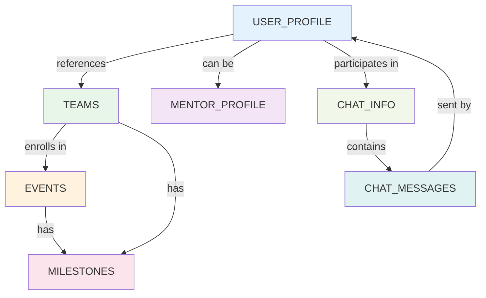

# Data Models - ES Backend

## Database Overview

- **Database System**: MongoDB (Document-oriented, NoSQL)
- **Database Name**: `ES`
- **Collections**: 7 main collections
- **Access Pattern**: Async pymongo client with connection pooling
- **Connection String**: `mongodb://localhost:27017/`

---

## Collection Schemas

### 1. USER_PROFILE Collection

**Purpose**: Store user account information and profile data

```json
{
  "_id": "ObjectId",
  "USER_ID": "uuid",
  "USER_NAME": "string",
  "BIO": "string (optional)",
  "TAGLINE": "string (optional)",
  "PLATFORM_STATUS": "string (enum: ACTIVE, INACTIVE, BANNED)",
  "LOCATION": "string (optional)",
  "TEAM_STATUS": "string (enum: LOOKING_FOR_TEAM, IN_TEAM, MENTOR)",
  "PROFILE_PIC": "string (URL to MinIO)",
  "PROFILE_BANNER": "string (URL to MinIO)",
  "CREATED_AT": "datetime",

  "GAME_RELATED_INFO": {
    "MAIN_GAME": "string",
    "RANK": "string (e.g., Diamond, Platinum)",
    "WIN_RATE": "number (0-100)",
    "TOURNAMENTS_PLAYED": "number"
  },

  "SOCIAL_LINKS": {
    "INSTAGRAM": "string (URL)",
    "DISCORD": "string (username)",
    "TWITTER": "string (handle)",
    "LINKEDIN": "string (URL)",
    "WEBSITE": "string (URL)",
    "YOUTUBE": "string (channel URL)"
  },

  "GAMES_PLAYED": [
    {
      "GAME_NAME": "string",
      "HOURS_PLAYED": "number",
      "RANK": "string",
      "SPECIALITY": "string"
    }
  ],

  "HISTORY": [
    {
      "TEAM_ID": "uuid",
      "TEAM_NAME": "string",
      "JOINED_DATE": "datetime",
      "LEFT_DATE": "datetime (optional)",
      "ROLE": "string"
    }
  ]
}
```

**Indexes** (Recommended):
```javascript
db.USER_PROFILE.createIndex({ "USER_ID": 1 }, { unique: true })
db.USER_PROFILE.createIndex({ "USER_NAME": 1 })
db.USER_PROFILE.createIndex({ "CREATED_AT": -1 })
```

**Theoretical Considerations**:

**Document Size**:
- Average document: 2-5 KB
- Maximum recommended: 16 MB (MongoDB limit)
- Current: Well within limits

**Embedding vs Referencing**:
```
Current (Embedding):
USER_PROFILE
  └─ HISTORY: [teams...] ✓ (Easy to fetch user + history)
  └─ GAMES_PLAYED: [games...] ✓ (Denormalized, bounded array)

Alternative (Referencing):
USER_PROFILE { USER_ID }
USER_HISTORY { USER_ID, TEAM_ID } ← Separate collection
USER_GAMES { USER_ID, GAME_NAME } ← Separate collection

Trade-off: Current approach is good until HISTORY/GAMES grow very large
```

**Growth Strategy**:
```
If HISTORY array grows beyond 1000 items:
├─ Create separate USER_HISTORY collection
├─ Store only recent 100 in USER_PROFILE
└─ Query USER_HISTORY for complete history
```

---

### 2. MENTOR_PROFILE Collection

**Purpose**: Store mentor profile data with ratings and specializations

```json
{
  "_id": "ObjectId",
  "MENTOR_ID": "uuid",
  "USER_NAME": "string",
  "BIO": "string (optional)",
  "TAGLINE": "string (optional)",
  "PROFILE_PIC": "string (URL)",
  "PROFILE_BANNER": "string (URL)",
  "LOCATION": "string (optional)",
  "EXPERIENCE_YEARS": "number",
  "PRICE_PER_SESSION": "number (USD)",
  "RATING": "number (0-5, e.g., 4.5)",
  "VERIFIED": "boolean",
  "SESSIONS_COMPLETED": "number",
  "SUCCESS_RATE": "number (0-100, percentage)",
  "CREATED_AT": "datetime",

  "SOCIAL_LINKS": {
    "INSTAGRAM": "string (URL)",
    "DISCORD": "string (username)",
    "TWITTER": "string (handle)",
    "LINKEDIN": "string (URL)",
    "WEBSITE": "string (URL)",
    "YOUTUBE": "string (channel URL)"
  },

  "GAMES": ["Valorant", "CS:GO", "League of Legends"],

  "SPECIALITIES": [
    {
      "GAME": "string",
      "AREA": "string (e.g., Agent Selection, Crosshair)",
      "PROFICIENCY": "string (BEGINNER, INTERMEDIATE, EXPERT)"
    }
  ],

  "LANGUAGES": ["English", "Hindi", "Spanish"],

  "SKILL_TAGS": ["coach", "teamplay", "strategy"]
}
```

**Indexes** (Recommended):
```javascript
db.MENTOR_PROFILE.createIndex({ "MENTOR_ID": 1 }, { unique: true })
db.MENTOR_PROFILE.createIndex({ "VERIFIED": 1, "RATING": -1 })
db.MENTOR_PROFILE.createIndex({ "GAMES": 1 })
db.MENTOR_PROFILE.createIndex({ "CREATED_AT": -1 })
```

**Theoretical Considerations**:

**Rating Calculation** (Denormalized Approach):
```
Current: Store RATING directly
├─ Pro: O(1) read performance
├─ Con: Must recalculate after each session
└─ Inconsistency risk: Manual recalculation errors

Alternative: Store only ratings, compute on read
├─ Pro: Always consistent
├─ Con: O(n) computation for each query

Better: Store both (cache pattern)
├─ RATING: number (denormalized cache)
├─ RECALCULATED_AT: datetime
└─ If > 1 hour old, recalculate on read
```

**Session Rating System**:
```
Exponential Moving Average:
Rating_new = (Rating_old × (n-1) + New_Rating) / n

Example:
Current: 4.0 (100 sessions)
New: 5.0
New_Rating = (4.0 × 99 + 5.0) / 100 = 4.01

Advantage: Respects historical data while incorporating new feedback
```

**Verification Workflow**:
```
State Diagram:
SIGNUP → PENDING_VERIFICATION → VERIFIED
                      ↓
                   REJECTED → CAN_REAPPLY

Timestamp Tracking:
├─ CREATED_AT: Account creation
├─ VERIFIED_AT: Verification completion time
└─ VERIFICATION_EXPIRES: Re-verify annually
```

---

### 3. TEAMS Collection

**Purpose**: Store team information and roster management

```json
{
  "_id": "ObjectId",
  "TEAM_ID": "uuid",
  "NAME": "string",
  "SHORT_NAME": "string (e.g., TGK)",
  "TAGLINE": "string (optional)",
  "TEAM_SIZE": "number (current roster size)",
  "TEAM_LOGO": "string (URL)",
  "TEAM_DESCRIPTION": "string (optional)",
  "GAME": "string",
  "CREATED_AT": "datetime",

  "PARTICIPANTS": [
    {
      "USER_ID": "uuid",
      "USER_NAME": "string",
      "ROLE": "string (e.g., IGL, Fragger, Support)",
      "ACCESS_LEVEL": "string (enum: ADMIN, MEMBER)",
      "JOINED_DATE": "datetime"
    }
  ],

  "MILESTONES": [
    {
      "MILESTONE_ID": "uuid",
      "NAME": "string",
      "DEADLINE": "datetime",
      "STATUS": "string (enum: Not Started, In Progress, Completed)"
    }
  ],

  "EVENTS_ENROLLED": [
    {
      "EVENT_ID": "uuid",
      "EVENT_NAME": "string",
      "ENROLLED_DATE": "datetime"
    }
  ]
}
```

**Indexes** (Recommended):
```javascript
db.TEAMS.createIndex({ "TEAM_ID": 1 }, { unique: true })
db.TEAMS.createIndex({ "NAME": 1 })
db.TEAMS.createIndex({ "GAME": 1 })
db.TEAMS.createIndex({ "PARTICIPANTS.USER_ID": 1 })
```

**Theoretical Considerations**:

**Array Growth Problem**:
```
Scenario: Large esports team (500+ players)

Current Structure:
TEAMS
  └─ PARTICIPANTS: [500 documents]

Problems:
├─ Document size grows
├─ MongoDB has 16MB doc limit
├─ Updating PARTICIPANTS is slow
└─ Fetching team returns all participants

Solution: Separate Collections
TEAMS { TEAM_ID, NAME, ... }
TEAM_ROSTERS { TEAM_ID, MEMBERS: [] } ← Separate for large rosters
TEAM_SUBSTITUTES { TEAM_ID, MEMBERS: [] } ← Alternative approach
```

**Recommendation**:
```
Current (< 100 players): Embed in TEAMS
Medium (100-500): Reference separate collection
Large (500+): Horizontal partitioning by role
```

**Access Control Model**:
```
Role-Based Access:
├─ ADMIN
│  ├─ Invite/Remove members
│  ├─ Edit team info
│  ├─ Enroll in events
│  └─ Manage milestones
├─ MEMBER
│  ├─ View team info
│  ├─ View events enrolled
│  └─ View milestones
└─ (None)
    └─ Send join request
```

**Event Enrollment Tracking**:
```
Current: EVENTS_ENROLLED array in TEAMS

Problem:
├─ Duplicate data (Event also stores teams)
├─ Synchronization required
└─ Inconsistency if update fails

Better:
├─ Single source: EVENTS stores team registrations
├─ TEAMS references events as denormalized cache
└─ Query events for source of truth
```

---

### 4. EVENTS Collection

**Purpose**: Store event/tournament information

```json
{
  "_id": "ObjectId",
  "EVENT_ID": "uuid",
  "EVENT_NAME": "string",
  "EVENT_DATE": "datetime",
  "REGISTRATION_DEADLINE": "datetime",
  "VENUE": "string (optional, for online: ONLINE)",
  "GAME": "string",
  "CONSOLE": "string (optional: PC, PS5, Xbox, Mobile)",
  "PRIZE_POOL": "number (USD)",
  "FORMAT": "string (enum: 1v1, 2v2, 5v5, BATTLE_ROYALE, SQUAD)",
  "IMAGE": "string (URL to event banner)",
  "ORGANIZER": "string (USER_ID or organization)",
  "CREATED_AT": "datetime",

  "CONTACT_INFO": {
    "EMAIL": "string",
    "MOBILE_NUMBER": "string (optional)"
  },

  "ELIGIBILITY": [
    {
      "TYPE": "string (RANK, REGION, AGE)",
      "VALUE": "string or array"
    }
  ],

  "QUESTIONNAIRE": [
    {
      "QUESTION_ID": "uuid",
      "QUESTION": "string",
      "ANSWER_TYPE": "string (TEXT, MULTIPLE_CHOICE, YES_NO)",
      "REQUIRED": "boolean",
      "OPTIONS": ["option1", "option2"] // for MULTIPLE_CHOICE
    }
  ],

  "FAQ": [
    {
      "QUESTION": "string",
      "ANSWER": "string"
    }
  ],

  "PARTICIPANTS": [
    {
      "USER_ID": "uuid (or TEAM_ID if team event)",
      "NAME": "string",
      "REGISTRATION_DATE": "datetime"
    }
  ],

  "STATUS": "string (enum: DRAFT, OPEN, CLOSED, IN_PROGRESS, COMPLETED)"
}
```

**Indexes** (Recommended):
```javascript
db.EVENTS.createIndex({ "EVENT_ID": 1 }, { unique: true })
db.EVENTS.createIndex({ "EVENT_NAME": 1 })
db.EVENTS.createIndex({ "GAME": 1 })
db.EVENTS.createIndex({ "EVENT_DATE": 1 })
db.EVENTS.createIndex({ "REGISTRATION_DEADLINE": 1 })
db.EVENTS.createIndex({ "PARTICIPANTS.USER_ID": 1 })
db.EVENTS.createIndex({ "STATUS": 1, "EVENT_DATE": -1 })
```

**Theoretical Considerations**:

**Event State Machine**:
```
DRAFT
  ├─ Can edit details
  ├─ Cannot register
  └─ Transition: → OPEN

OPEN
  ├─ Accepting registrations
  ├─ Cannot edit critical fields
  └─ Transition: → CLOSED

CLOSED
  ├─ Registration deadline passed
  ├─ Cannot register
  └─ Transition: → IN_PROGRESS

IN_PROGRESS
  ├─ Event is live
  ├─ Scoring updates happening
  └─ Transition: → COMPLETED

COMPLETED
  ├─ Final results published
  ├─ View-only
  └─ Terminal state
```

**Eligibility Filtering**:
```
Example Eligibility:
[
  { TYPE: "RANK", VALUE: "GOLD or above" },
  { TYPE: "REGION", VALUE: ["NA", "EU"] },
  { TYPE: "AGE", VALUE: "18+" }
]

Query: Find eligible users
├─ Get user RANK
├─ Get user REGION
├─ Get user AGE
└─ Check against all eligibility rules (AND logic)
```

**Dynamic Questionnaire**:
```
Flexible Q&A system for registration:
├─ Admin defines questions at event creation
├─ Users answer during registration
├─ Responses stored separately (EVENT_RESPONSES collection)
└─ Useful for skill assessment, preferences, etc.
```

**Event Capacity Management**:
```
Pattern 1: Soft limit
├─ Allow registrations over limit
├─ Manual acceptance needed

Pattern 2: Hard limit (Current: Vulnerable to race condition)
├─ MAX_PARTICIPANTS: 100
├─ Reject if count >= max
└─ Problem: Race condition without atomic check-and-set

Pattern 3: Queue-based (Recommended)
├─ QUEUE: [users...]
├─ ACCEPTED: [users...]
├─ As users drop out, queue moves forward
└─ Fair allocation
```

---

### 5. MILESTONES Collection

**Purpose**: Track team milestones and progress

```json
{
  "_id": "ObjectId",
  "MILESTONE_ID": "uuid",
  "TEAM_ID": "uuid",
  "PERSONA": "string (e.g., Team Captain, Coach)",
  "ID": "number (sequential for team)",
  "NAME": "string",
  "DEADLINE": "datetime",
  "STATUS": "string (enum: Not Started, In Progress, Completed, Overdue, Cancelled)",
  "DESCRIPTION": "string (optional)",
  "CREATED_AT": "datetime",
  "UPDATED_AT": "datetime (optional)",

  "TASKS": [
    {
      "TASK_ID": "uuid",
      "NAME": "string",
      "COMPLETED": "boolean",
      "COMPLETED_AT": "datetime (optional)"
    }
  ]
}
```

**Indexes** (Recommended):
```javascript
db.MILESTONES.createIndex({ "MILESTONE_ID": 1 }, { unique: true })
db.MILESTONES.createIndex({ "TEAM_ID": 1, "DEADLINE": 1 })
db.MILESTONES.createIndex({ "STATUS": 1, "DEADLINE": -1 })
```

**Theoretical Considerations**:

**Progress Tracking**:
```
Milestone
├─ Overall STATUS (rollup of tasks)
├─ TASKS array
│  └─ [Task1: completed, Task2: pending, Task3: completed]
└─ Progress: 2/3 = 66.7%

Calculation:
Completed_Tasks / Total_Tasks * 100
```

**Deadline Management**:
```
Workflow:
1. Milestone created with DEADLINE
2. Background job checks daily:
   IF DEADLINE < NOW AND STATUS != "Completed"
     STATUS = "Overdue"
     Notify team
3. Team can still complete after deadline (marked as "Late")

Recommendation: Implement daily batch job
```

---

### 6. CHAT_INFO Collection

**Purpose**: Store chat conversation metadata

```json
{
  "_id": "ObjectId",
  "CHAT_ID": "uuid",
  "CREATED_AT": "datetime",
  "UPDATED_AT": "datetime",
  "PARTICIPANTS": [
    {
      "USER_ID": "uuid",
      "JOINED_AT": "datetime"
    }
  ],
  "TYPE": "string (enum: DM, GROUP)",
  "LAST_MESSAGE_ID": "uuid (reference to latest message)"
}
```

**Indexes** (Recommended):
```javascript
db.CHAT_INFO.createIndex({ "CHAT_ID": 1 }, { unique: true })
db.CHAT_INFO.createIndex({ "PARTICIPANTS.USER_ID": 1 })
db.CHAT_INFO.createIndex({ "UPDATED_AT": -1 })
```

---

### 7. CHAT_MESSAGES Collection

**Purpose**: Store individual chat messages

```json
{
  "_id": "ObjectId",
  "MESSAGE_ID": "uuid",
  "CHAT_ID": "uuid",
  "SENDER_ID": "uuid",
  "MESSAGE": "string",
  "CREATED_AT": "datetime",
  "EDITED_AT": "datetime (optional)",
  "DELETED_AT": "datetime (optional, soft delete)",
  "ATTACHMENTS": [
    {
      "FILE_ID": "uuid",
      "FILE_NAME": "string",
      "FILE_SIZE": "number (bytes)",
      "MIME_TYPE": "string"
    }
  ],
  "REACTIONS": [
    {
      "EMOJI": "string",
      "USERS": ["user_id1", "user_id2"]
    }
  ]
}
```

**Indexes** (Recommended):
```javascript
db.CHAT_MESSAGES.createIndex({ "CHAT_ID": 1, "CREATED_AT": -1 })
db.CHAT_MESSAGES.createIndex({ "SENDER_ID": 1 })
db.CHAT_MESSAGES.createIndex({ "DELETED_AT": 1 }) // For soft delete queries
```

**Theoretical Considerations**:

**Time-Series Data**:
```
CHAT_MESSAGES is time-series:
├─ High insertion volume
├─ Reads in time windows
└─ Archival/deletion after period

Optimization:
├─ Use TTL index: db.CHAT_MESSAGES.createIndex({"CREATED_AT": 1}, {expireAfterSeconds: 7776000})
└─ Archive old messages to separate collection
```

**Soft Delete Pattern**:
```
Instead of DELETE, mark with DELETED_AT:
├─ DELETED_AT: null → Active message
├─ DELETED_AT: timestamp → Deleted message
└─ Query: Find messages WHERE DELETED_AT IS NULL

Benefit:
├─ Recoverable deletions
├─ Audit trail
└─ No data loss
```

---

## Data Relationships Diagram



---

## Normalization vs Denormalization Analysis

### Current Approach: Hybrid

**Denormalized Data**:
```
✓ USER_PROFILE.GAMES_PLAYED: Array of game objects (duplication)
✓ TEAM.PARTICIPANTS: Array with user names (duplication)
✓ EVENT.PARTICIPANTS: Array with user names (duplication)
✓ MENTOR_PROFILE.GAMES: Array of game names (duplication)
```

**Normalized Data**:
```
✓ MILESTONES: Separate collection (reference via MILESTONE_ID)
✓ CHAT_MESSAGES: Separate collection (reference via CHAT_ID)
```

**Trade-off Analysis**:
| Aspect | Denormalized | Normalized |
|--------|-------------|-----------|
| Read Performance | Better | Worse (join required) |
| Write Complexity | Higher | Lower |
| Storage | Higher | Lower |
| Consistency | Harder | Easier |
| Update Frequency | Impacts choice | - |

**Recommendation**:
```
Current denormalization is appropriate for:
├─ Read-heavy data (profiles, rosters)
├─ Infrequently updated fields
└─ Necessary for query performance

Future normalization needed if:
├─ Update frequency increases (e.g., daily team roster changes)
├─ Data grows large (duplicate names becomes problem)
└─ Consistency issues arise
```

---

## Theoretical: Database Design Patterns

### Pattern 1: Document Storage (Current)
```
Pros:
├─ Flexible schema
├─ Natural nested structures
├─ No joins needed
└─ Scalable

Cons:
├─ Denormalization complexity
├─ Data duplication
├─ Large documents
└─ Update anomalies
```

### Pattern 2: Collection per Entity (Alternative)
```
Instead of: USER_PROFILE with GAMES_PLAYED array
Use: USER_PROFILE collection + GAME_PROFICIENCY collection

USER_PROFILE { USER_ID, NAME, ... }
GAME_PROFICIENCY { USER_ID, GAME_ID, HOURS, RANK, ... }

Pros: Normalized, cleaner
Cons: Requires joins, slower queries
```

### Pattern 3: Event Sourcing (Future Enhancement)
```
Instead of: EVENTS collection with STATUS field
Use: EVENT_EVENTS collection with event log

EVENT_EVENTS
├─ { EVENT_ID, type: "CREATED", timestamp, data }
├─ { EVENT_ID, type: "REGISTRATION_OPENED", timestamp }
├─ { EVENT_ID, type: "PARTICIPANT_ADDED", timestamp, USER_ID }
├─ { EVENT_ID, type: "STATUS_CHANGED", timestamp, new_status }
└─ { EVENT_ID, type: "COMPLETED", timestamp, results }

Pros:
├─ Complete audit trail
├─ Temporal queries (state at any point in time)
├─ Event replay capability
└─ Debug-friendly

Cons:
├─ More storage
├─ Requires reconstruction of current state
└─ Complex queries
```

---

## Summary

The current data model:
- ✅ Optimized for read-heavy workloads
- ✅ Appropriate for embedded documents (profiles, rosters)
- ⚠️ Vulnerable to duplication inconsistencies
- ⚠️ Arrays should have bounded size

Recommended improvements:
1. Add MongoDB validation schemas
2. Implement unique indexes to prevent duplicates
3. Add TTL indexes for chat message archival
4. Plan for collection splitting as data grows
5. Implement audit logging for critical updates

