# Sequence Diagrams - ES Backend

This document contains detailed sequence diagrams for major workflows in the system, using Mermaid syntax.

---

## 1. User Creation Flow

### Diagram
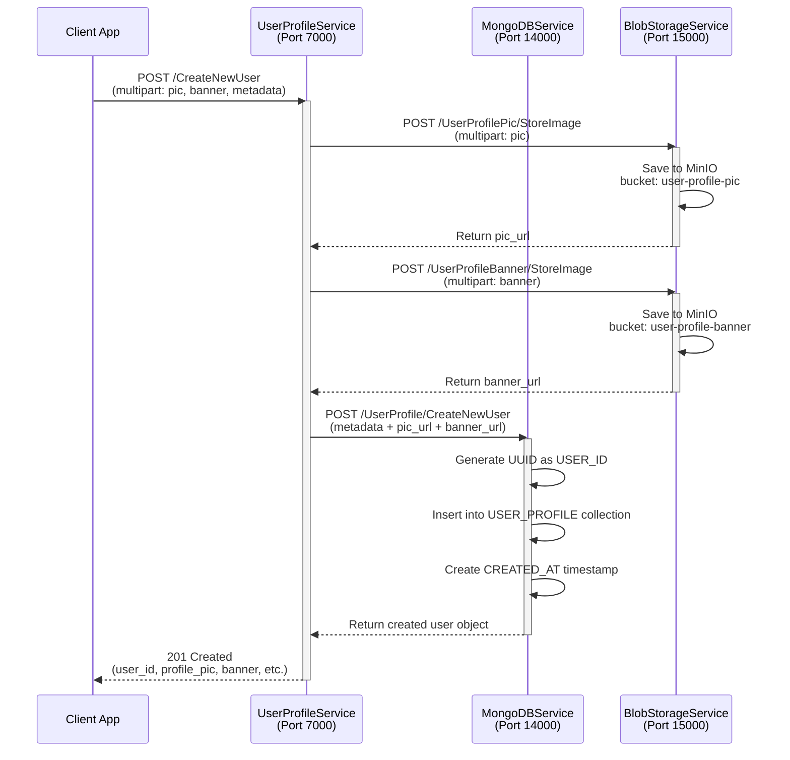

### Theoretical Aspects

**Transaction Model**: Eventual Consistency
- Image uploads are atomic (succeed or fail completely)
- Database insert is atomic
- No cross-service transactions
- If DB write fails after image upload, images are orphaned (cleanup needed)

**Error Scenarios**:
1. **Image upload fails** → Return error immediately, no database changes
2. **Database write fails** → Images uploaded but user not created (inconsistency)
3. **Network timeout** → Client retries, duplicate detection needed

**Optimization Opportunities**:
- Parallel image uploads (not currently done)
- Caching user profile in Redis
- Batch user creation for bulk imports

---

## 2. Event Creation Flow

### Diagram
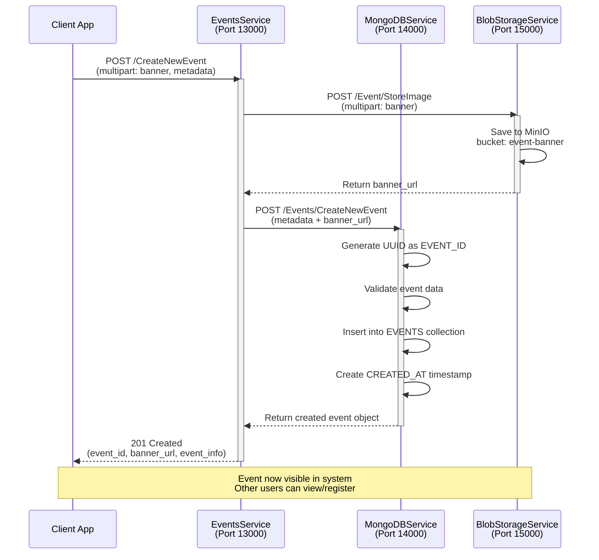

### Theoretical Aspects

**Resource Creation Pattern**:
- External resources (images) created first
- Database record created after external dependencies succeed
- Rollback not implemented (orphaned resources possible)

**Idempotency**:
- No idempotency key in current implementation
- Retried requests create duplicate events
- **Recommendation**: Add request ID tracking

**Event Lifecycle**:
```
CREATED → REGISTRATION_OPEN → REGISTRATION_CLOSED → IN_PROGRESS → COMPLETED
  ↑                                                                    ↓
  └────────────────────────────────────────────────────────────────┘
                         (Cancelled/Archived)
```

**Concurrent Registrations**:
- No reservation system
- Race conditions possible (participant limit)
- Needs optimistic locking or reservation queue

---

## 3. Team Creation Flow

### Diagram
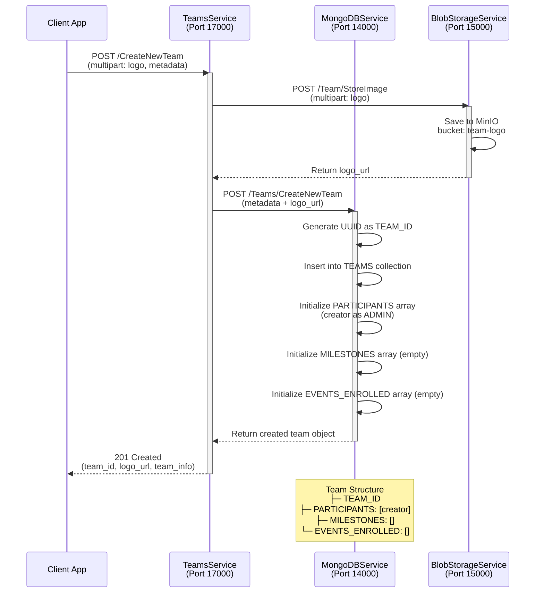

### Theoretical Aspects

**Roster Management**:
- Participants stored as objects with USER_ID + ACCESS_LEVEL
- Access levels: ADMIN (full control), MEMBER (read-only)
- No automatic role assignment based on creation

**Scalability Concerns**:
```
Team Size         Concerns
─────────────────────────────────
<50 players       None
50-500 players    Array grows large in document
500-5000 players  Performance degradation
5000+ players     Must use separate collection
```

**Recommendation**: For large teams, use separate TEAM_ROSTERS collection:
```
TEAMS → { TEAM_ID, NAME, LOGO, ... }
TEAM_ROSTERS → { ROSTER_ID, TEAM_ID, PARTICIPANTS: [...] }
```

---

## 4. Mentor Profile Creation Flow

### Diagram
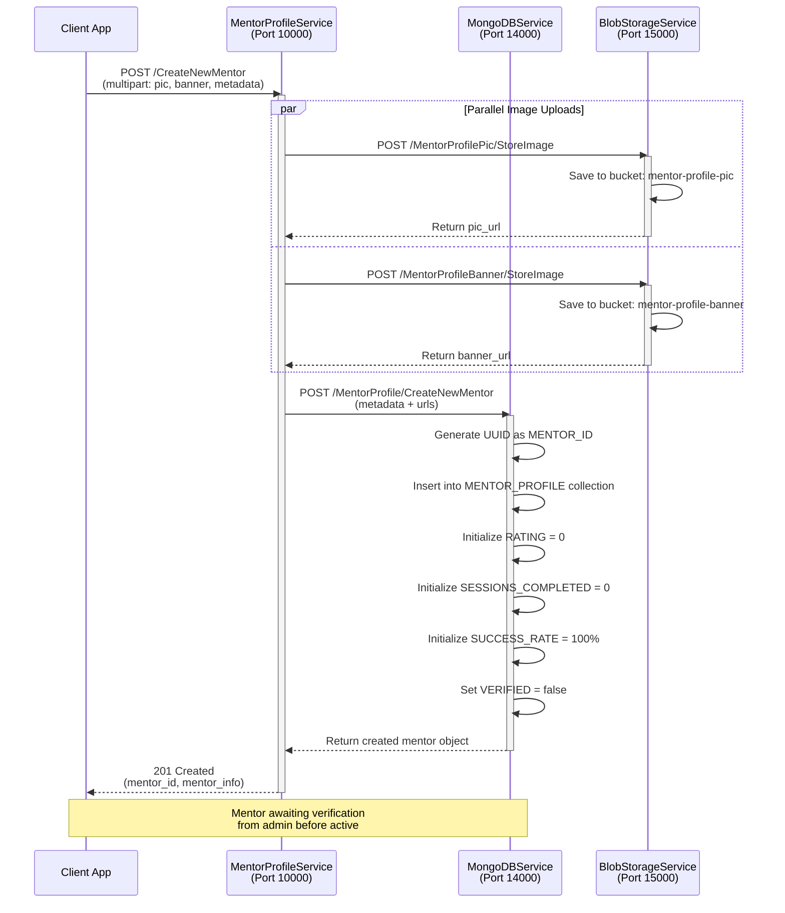

### Theoretical Aspects

**Verification Workflow**:
```
Mentor Signup → Admin Review → VERIFIED = true → Can Accept Sessions
                    ↓
                 Rejected → VERIFIED = false → Cannot Accept Sessions
```

**Rating System**:
```
Session Completed
    ↓
Student Rate Mentor (1-5 stars)
    ↓
new_rating = (old_rating × sessions_completed + new_rating) / (sessions_completed + 1)
    ↓
success_rate = (successful_sessions / total_sessions) × 100%
```

**Session Booking Flow** (Not yet implemented):
```
Student Request → Mentor Confirm → Session Scheduled → Session Completed → Rating
```

---

## 5. Event Registration Flow

### Diagram
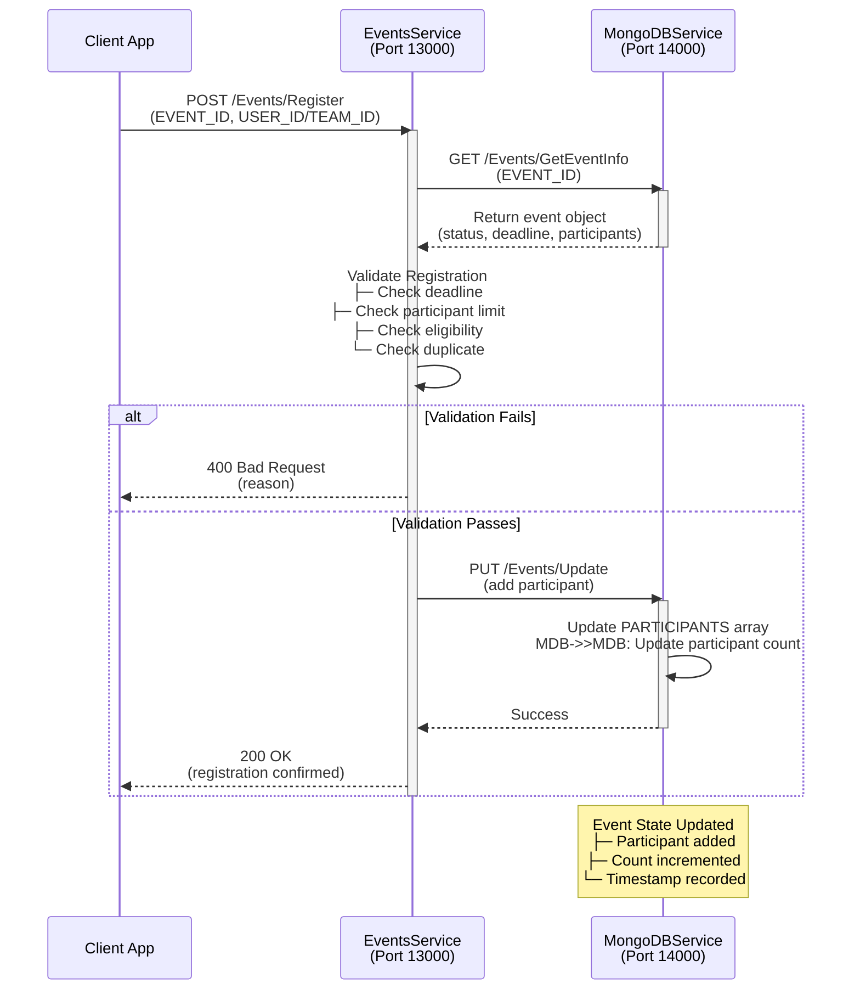

### Theoretical Aspects

**Race Condition Scenario**:
```
Scenario: Participant Limit = 100, Current = 99

Request A                        Request B
   │                               │
   ├─ Check count < 100 ✓         │
   │                               ├─ Check count < 100 ✓
   │                               │
   ├─ Insert participant           │
   │ (Count = 100) ✓               │
   │                               ├─ Insert participant
   │                               │ (Count = 101) ✗
   │                               │
   └─ Return 200                   └─ Return 500
                                      (Oversubscribed)
```

**Solution Options**:
1. **Optimistic Locking**: Version check before update
2. **Pessimistic Locking**: Lock document during update (slower)
3. **Reservation Queue**: Queue participants, assign slots sequentially
4. **Atomic Counter**: Use MongoDB atomic operations

**Recommendation**: MongoDB atomic update:
```javascript
db.EVENTS.findOneAndUpdate(
  { EVENT_ID: id, participants_count: { $lt: max } },
  { $inc: { participants_count: 1 }, $push: { participants: user_id } }
)
```

---

## 6. Team Enrollment in Event

### Diagram
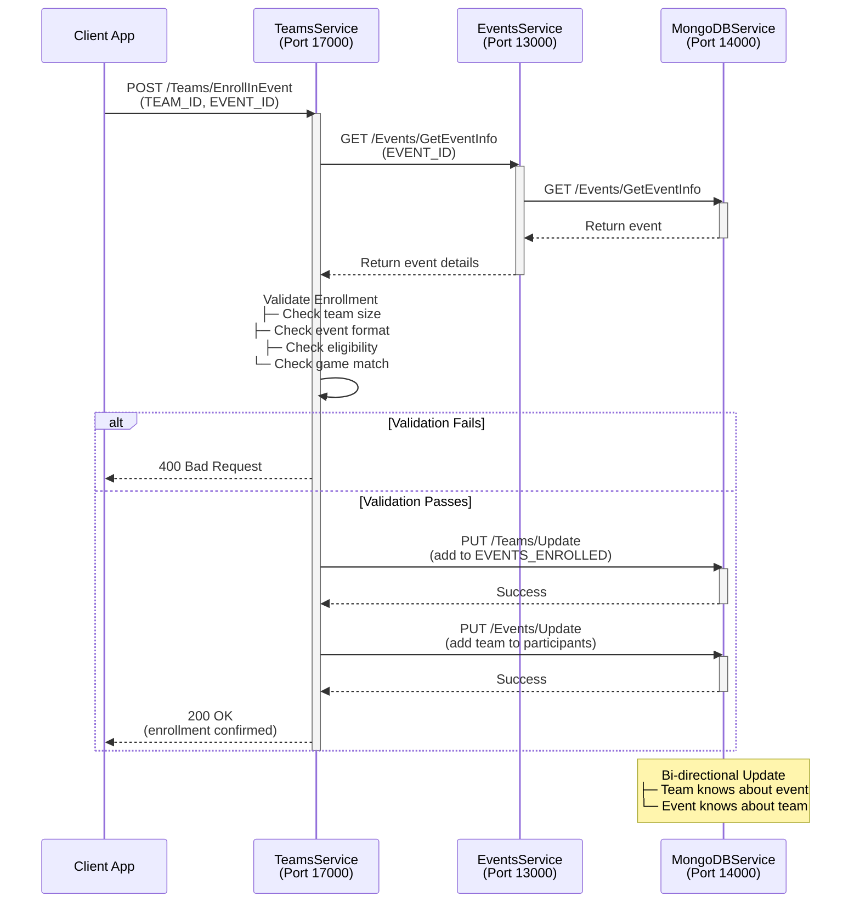

### Theoretical Aspects

**Data Consistency Issue**:
- Updates to both TEAMS and EVENTS collections
- No transaction spanning both
- If TEAMS update succeeds but EVENTS fails: inconsistency

**Better Approach** (Recommended):
```
Single source of truth: EVENTS collection stores all team registrations
Teams collection references events: { EVENTS_ENROLLED: [event_id1, event_id2] }
Queries fetch from single collection for consistency
```

---

## 7. Milestone Creation and Tracking

### Diagram
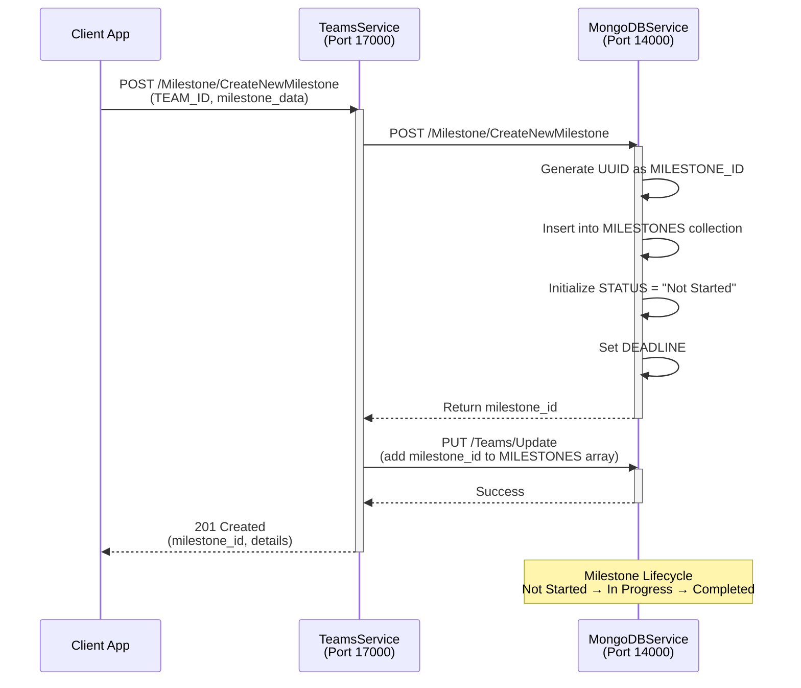

### Milestone Update Flow
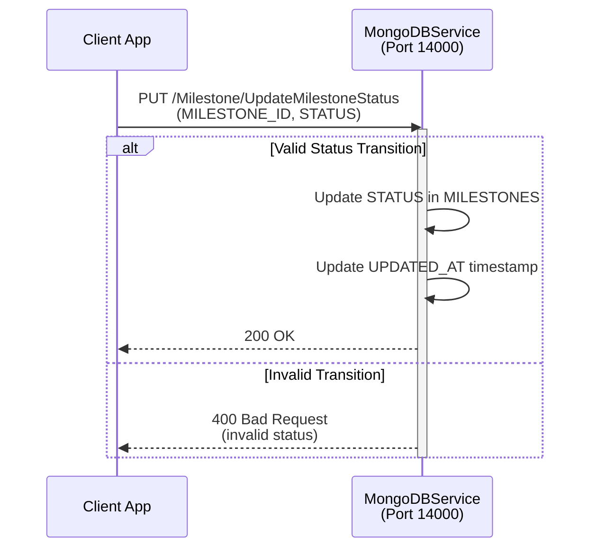

### Theoretical Aspects

**Milestone State Machine**:
```
Not Started
    ↓
    ├─→ In Progress
    │        ↓
    │        └─→ Completed ✓
    │
    └─→ Cancelled (Alternative end state)
```

**Deadline Management**:
```
Milestone Created with DEADLINE
    ↓
System Check (Daily/Hourly Job)
    ├─ If DEADLINE passed and STATUS ≠ "Completed"
    │  └─ Mark as "Overdue" or auto-fail
    │
    └─ Send notification to team
```

**Recommendation**: Add DEADLINE_EXCEEDED status or automatic job to mark overdue milestones.

---

## 8. Cross-Service Communication Pattern

### Diagram
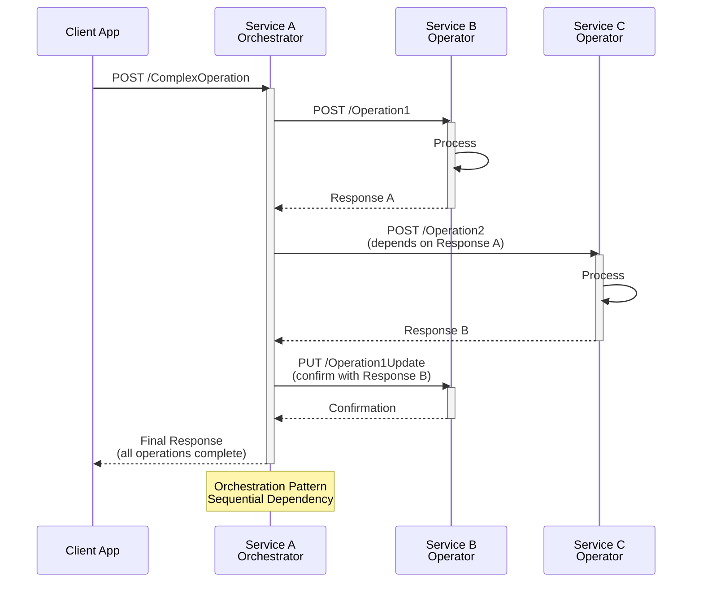

### Theoretical Aspects

**Orchestration vs Choreography**:

**Current (Orchestration)**:
```
Client → ServiceA → ServiceB ─┐
                              └─→ ServiceC
ServiceA controls flow
```

**Alternative (Choreography)**:
```
ServiceA emits Event
    ↓
ServiceB listens → emits Event
    ↓
ServiceC listens → completes
```

**Trade-offs**:
| Aspect | Orchestration | Choreography |
|--------|---------------|--------------|
| Coupling | Higher | Lower |
| Complexity | Centralized | Distributed |
| Debuggability | Easier | Harder |
| Scalability | Limited | Better |

---

## 9. System-Wide Data Flow

### Diagram
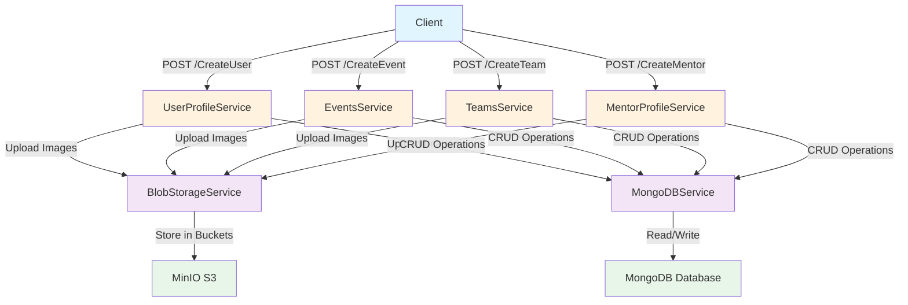

---

## 10. Error Handling and Retry Flow

### Diagram
```mermaid
sequenceDiagram
    participant Client as Client
    participant Service as Service
    participant DB as Database

    Client->>Service: Request
    activate Service

    Service->>DB: Operation
    activate DB

    alt Success
        DB-->>Service: Data
        deactivate DB
        Service-->>Client: 200 OK
    else Connection Error
        DB--x Service: Timeout
        deactivate DB

        Service->>Service: Wait 100ms (exponential backoff)
        Service->>DB: Retry #1
        activate DB

        alt Success
            DB-->>Service: Data
            deactivate DB
            Service-->>Client: 200 OK
        else Still Failing
            DB--x Service: Timeout
            deactivate DB
            Service-->>Client: 503 Service Unavailable
        end
    else Database Error
        DB-->>Service: 500 Error
        deactivate DB
        Service-->>Client: 500 Internal Server Error
    else Validation Error
        Service->>Service: Validate Input
        Service-->>Client: 422 Unprocessable Entity
    end

    deactivate Service
```

---

## 11. Theoretical: Distributed Transaction Pattern

### The Problem
```
Transaction: User Registration + Team Creation + Event Enrollment

Step 1: Create User in MongoDB ✓
Step 2: Create Team in MongoDB ✓
Step 3: Enroll Team in Event in MongoDB... ✗ (Database down!)

Result: Inconsistent state (user + team exist, but not enrolled in event)
```

### Two-Phase Commit (Not Implemented)

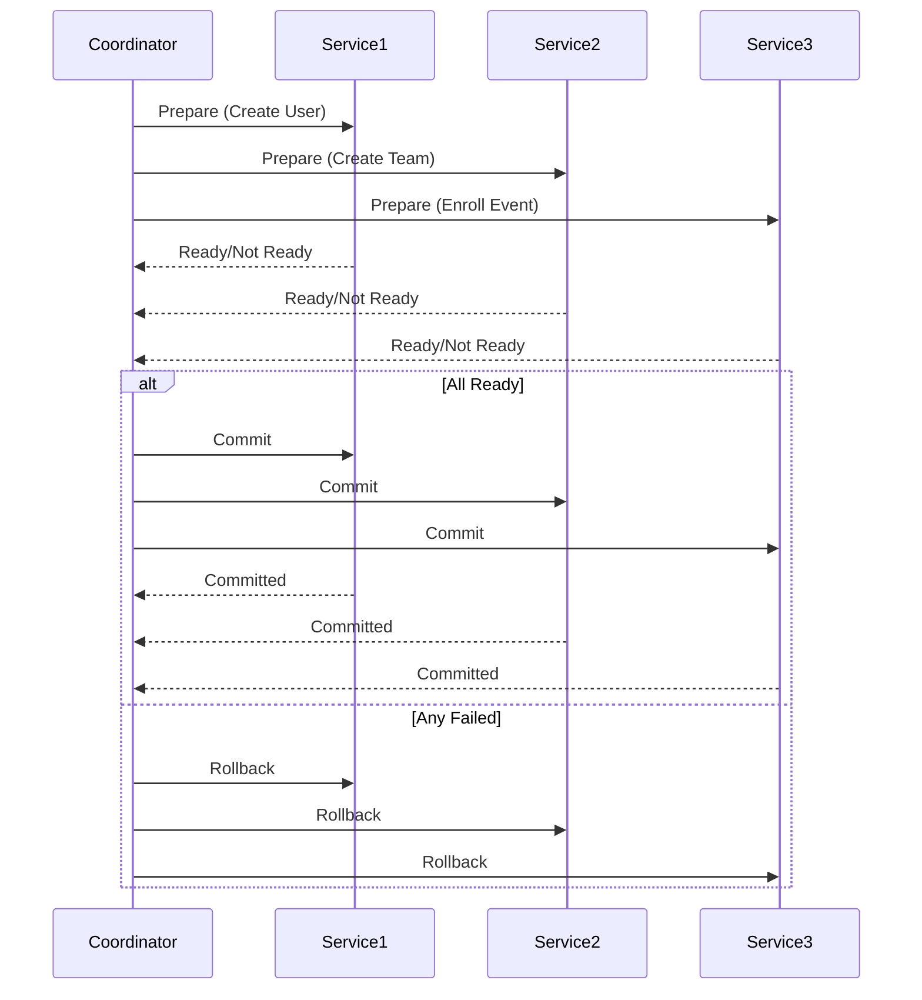

**Current System**: Does NOT use two-phase commit (eventual consistency instead)

---

## Summary

These sequence diagrams illustrate:
- **Current Implementation**: Synchronous REST-based orchestration
- **Theoretical Concerns**: Race conditions, eventual consistency, transaction boundaries
- **Future Improvements**: Async messaging, two-phase commit, saga pattern
- **Scalability**: Bottlenecks at database and orchestration service

All diagrams follow the microservices communication pattern: Client → Orchestrator → Infrastructure Services → Data Stores.
